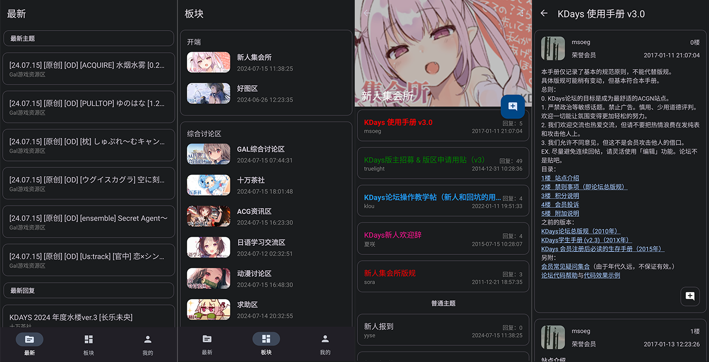
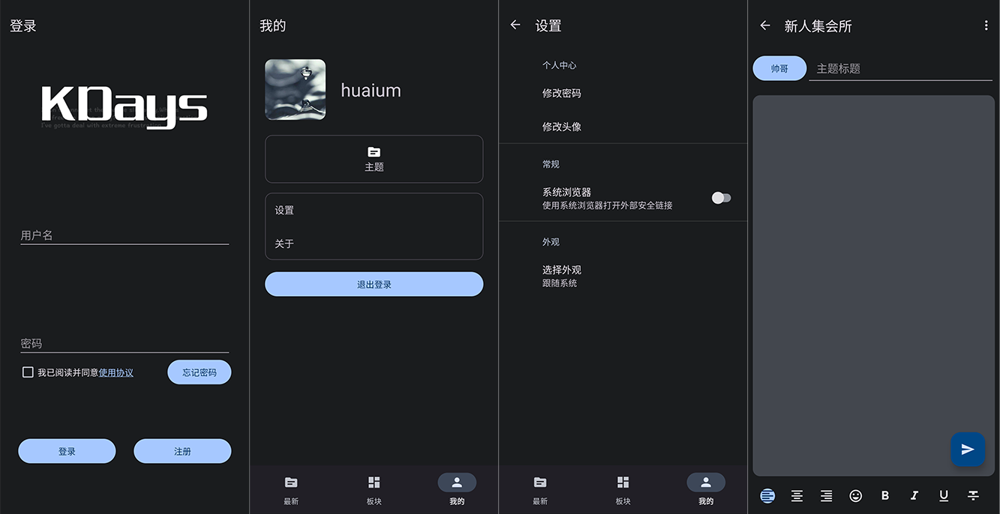

# KDaysAndroid

`KDaysAndroid` is an Android client for `KDays Forum`.

<p align="center"></p>

## Download

[Releases](https://github.com/huaium/KDaysAndroid/releases)

## Build

Create a file `keystore.properties` in the root directory of your project and define your properties as follows.

```properties
# Keystore of UC and BBS
UC_ADDRESS=# Type your UC address, the same below
UC_ADDRESS_DEBUG=
UC_KEY=
UC_SECRET=
BBS_ADDRESS=
BBS_ADDRESS_DEBUG=
BBS_KEY=
BBS_SECRET=
```

After configuration, you can run `app` to test it.

## Screenshots





## Acknowledgements

* [Compose Rich Editor](https://github.com/MohamedRejeb/Compose-Rich-Editor)

## License

```markdown
Copyright 2024 Huaium

Licensed under the Apache License, Version 2.0 (the "License");
you may not use this file except in compliance with the License.
You may obtain a copy of the License at

    http://www.apache.org/licenses/LICENSE-2.0

Unless required by applicable law or agreed to in writing, software
distributed under the License is distributed on an "AS IS" BASIS,
WITHOUT WARRANTIES OR CONDITIONS OF ANY KIND, either express or implied.
See the License for the specific language governing permissions and
limitations under the License.
```

